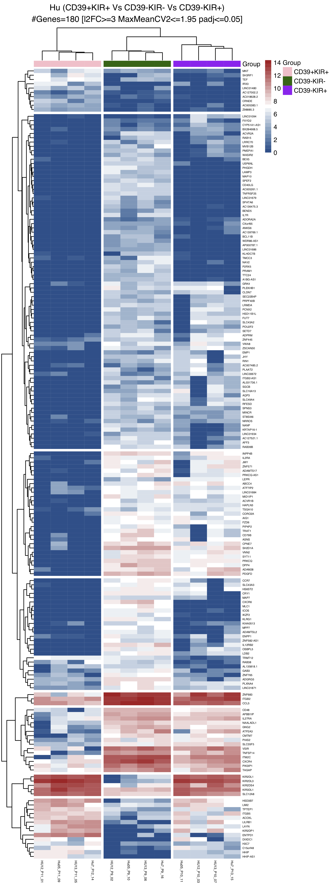

# Continuous human uterine NK cell differentiation in response to endometrial regeneration and pregnancy

**Benedikt Strunz<sup>1,*</sup>, Jonna Bister<sup>1</sup>, Russell S. Hamilton<sup>2</sup>, Hanna Jönsson<sup>1</sup>, Ylva Crona-Guterstam<sup>1,3</sup>, Egle Kvedaraite<sup>1,3</sup>, Iva Filipovic<sup>1</sup>, Natalie Sleiers<sup>1</sup>, Bogdan Dumitrescu<sup>4</sup>, Danielle Friberg<sup>5</sup>, Mats Brännström<sup>6</sup>, Antonio Lentini<sup>7</sup> , Björn Reinius<sup>7</sup>, Martin Cornillet<sup>1</sup>, Tim Willinger<sup>1</sup>, Sebastian Gidlöf<sup>3</sup>, Martin A. Ivarsson<sup>1</sup> & Niklas K. Björkström<sup>1,*</sup>**

<sup>1</sup> Center for Infectious Medicine, Department of Medicine Huddinge, Karolinska Institutet, Karolinska University Hospital, Stockholm, Sweden <br>
<sup>2</sup> Centre for Trophoblast Research, University of Cambridge, Cambridge, UK <br>
<sup>3</sup> Department of Women’s and Children’s Health, Karolinska Institutet, Stockholm, Sweden <br>
<sup>4</sup> Department of Obstetrics and Gynecology, Mälarsjukhuset, Eskilstuna, Sweden <br>
<sup>5</sup> Department of Surgical Sciences, Uppsala University, Uppsala, Sweden <br>
<sup>6</sup> Department of Obstetrics and Gynecology, University of Gothenburg, Gothenburg, Sweden <br>
<sup>7</sup> Department of Medical Biochemistry and Biophysics, Karolinska Institutet, Stockholm, Sweden <br>
<sup>*</sup> Corresponding authors: benedikt.strunz@ki.se, niklas.bjorkstrom@ki.se


### Publication ###

Strunz, B., Bister, J., Hamilton, R.S., Jönsson, H., Crona-Guterstam, Y., Kvedaraite, E.,  Filipovic, I., Sleiers, N., Dumitrescu, B., Friberg, D., Brännström, M., Lentini, A., Reinius, B., Cornillet, M., Willinger, T., Gidlöf, S., Ivarsson, M.A., & Björkström, N.K. [[<s>JOURNAL</s>]](https://) [[<s>DOI</s>]](https://doi.org/)

### Abstract ###

On publication

### Bulk RNA-Seq ###

RNA-seq data have been deposited in the ArrayExpress database at EMBL-EBI under accession number [E-MTAB-8709](https://www.ebi.ac.uk/arrayexpress/experiments/E-MTAB-8709)

#### Sample Table ####

| Sample Name	| Group      |
| ----------- | ---------- |
| 1_HU12_P11  | CD39+KIR+  |
| 2_HU12_P9	  | CD39-KIR-  |
| 3_HU12_P10  | CD39-KIR+  |
| 5_HU13_P11  | CD39+KIR+  |
| 6_HU13_P9	  | CD39-KIR-  |
| 7_HU13_P10  | CD39-KIR+  |
| 9_Hu05_P11	| CD39+KIR+  |
| 10_Hu05_P9	| CD39-KIR-  |
| 11_Hu05_P10	| CD39-KIR+  |
| 14_Hu7_P12	| CD39+KIR+  |
| 15_Hu7_P13	| CD39-KIR+  |
| 16_Hu7_P9	  | CD39-KIR-  |


#### Data Processing ####

Raw sequencing files are run through quality control using FastQC (v0.11.5) and fastq_screen (v0.9.3). Low quality and adapter sequencing are trimmed with Trim Galore! (v0.6.4). Trimmed reads are aligned to the reference genome (GRCh38, ensEMBL) using STAR (v020201). Alignments are assessed using qualimap (v2.2) and featureCounts (v 1.5.0-p2). Gene quantification is performed with featureCounts (v 1.5.0-p2). Differential gene expression is performed with DESeq2 package (v1.22.2, R v3.5.3), including principle component analysis (PCA) to assess sample clustering, and multiple testing correction to produce false discovery rates. Finally all metrics from the RNA-Seq pipelines are summarised and reports produced using MultiQC (0.9.dev0).

> Additional Processing Steps

CV2

> Resources Used

Resource       | URL
-------------- | --------------
GRCh38         | [Link](https://www.ensembl.org/Homo_sapiens/Info/Index)
FastQC         | [Link](http://www.bioinformatics.babraham.ac.uk/projects/fastqc/)
Trim_galore    | [Link](http://www.bioinformatics.babraham.ac.uk/projects/trim_galore/)
STAR           | [DOI](https://doi.org/10.1093/bioinformatics/bts635)
HTSeq-counts   | [DOI](http://dx.doi.org/10.1093/bioinformatics/btu638)
Feature_counts | [DOI](http://dx.doi.org/10.1093/bioinformatics/btt656)
Qualimap       | [DOI](https://doi.org/10.1093/bioinformatics/bts503)
RSeQC          | [DOI](http://doi.org/10.1093/bioinformatics/bts356)
ClusterFlow    | [DOI](http://dx.doi.org/10.12688/f1000research.10335.2)
MultiQC        | [DOI](http://dx.doi.org/10.1093/bioinformatics/btw354)

##### Bulk RNA-Seq Pipeline #####

Pipeline run using [ClusterFlow](http://clusterflow.io)

    #fastqc
    #fastq_screen
    #trim_galore
          #fastqc
          #star
            #qualimap_rnaseq
            #rseqc_infer_experiment
            #featureCounts
            #htseq_counts

FeatureCount gene count files are available in the [FeatureCount](FeatureCount/) directory

#### Script to reproduce paper figures (Bulk RNA-Seq only) ####

The R script used to generate the figures in the paper is [RSH_KI_0001.QC.R](RSH_KI_0001.QC.R) available to download. Required R-packages are listed at the top of the file and must be installed prior to running the script.

Figure        | File | Description
------------- | ---- | ----------
Figure 2 F   |  <br>[[PDF](QC/RSH_KI_0001_Fig.PCA.Final.pdf)] [[PNG](QC/RSH_KI_0001_Fig.PCA.Final.png)]| <b>A.</b> PCA for top 500 most variable genes
Figure 2 G (left)   |  <br>[[PDF](DifferentialGeneExpression/RSH_KI_0001_DESeq2_DEGs_padj_0.05_l2fc_1.5_CV2_1.95_read_10_Hu_CD39pKIRp_vs_Hu_CD39mKIRm_Volcanoplot_V3.pdf)] [[PNG](DifferentialGeneExpression/RSH_KI_0001_DESeq2_DEGs_padj_0.05_l2fc_1.5_CV2_1.95_read_10_Hu_CD39pKIRp_vs_Hu_CD39mKIRm_Volcanoplot_V3.png)]| Volcano plot for KIR+CD39+ Vs KIR-CD39-
Figure 2 G (right)   |  <br>[[PDF](DifferentialGeneExpression/RSH_KI_0001_DESeq2_DEGs_padj_0.05_l2fc_1.5_CV2_1.95_read_10_Hu_CD39pKIRp_vs_Hu_CD39mKIRp_Volcanoplot_V3.pdf)] [[PNG](DifferentialGeneExpression/RSH_KI_0001_DESeq2_DEGs_padj_0.05_l2fc_1.5_CV2_1.95_read_10_Hu_CD39pKIRp_vs_Hu_CD39mKIRp_Volcanoplot_V3.png)]| Volcano plot for KIR+CD39+ Vs KIR+CD39-
Figure S2 A   |  <br>[[PDF](QC/RSH_KI_0001_Fig.PCA.Final.pdf)] [[PNG](QC/RSH_KI_0001_Fig.PCA.Final.png)]| <b>B.</b> PCA Principle components explained
Figure S2 B   |  <br> [[PDF](DifferentialGeneExpression/RSH_KI_0001_DEGs_padj_0.05_l2fc_3_CV2_1.95_HeatMap_Hu_CD39pKIRp_vs_CD39mKIRm_vs_CD39mKIRp_V3.pdf)] [[PNG](DifferentialGeneExpression/RSH_KI_0001_DEGs_padj_0.05_l2fc_3_CV2_1.95_HeatMap_Hu_CD39pKIRp_vs_CD39mKIRm_vs_CD39mKIRp_V3.png)]| Heatmap summarising differentially expressed genes from the three comparisons
Figure S2 C   |  <br> [[PDF](DifferentialGeneExpression/RSH_KI_0001_DESeq2_DEGs_padj_0.05_l2fc_1.5_CV2_1.95_read_10_Hu_CD39mKIRp_vs_Hu_CD39mKIRm_Volcanoplot_V3.pdf)] [[PNG](DifferentialGeneExpression/RSH_KI_0001_DESeq2_DEGs_padj_0.05_l2fc_1.5_CV2_1.95_read_10_Hu_CD39mKIRp_vs_Hu_CD39mKIRm_Volcanoplot_V3.png)]| Volcano plot for KIR+CD39- Vs KIR-CD39-

### Session Information ###
Details for the R version and packages used to create all figures

````
> sessionInfo()
R version 3.4.4 (2018-03-15)
Platform: x86_64-apple-darwin15.6.0 (64-bit)
Running under: macOS  10.14.6

Matrix products: default
BLAS: /System/Library/Frameworks/Accelerate.framework/Versions/A/Frameworks/vecLib.framework/Versions/A/libBLAS.dylib
LAPACK: /Library/Frameworks/R.framework/Versions/3.4/Resources/lib/libRlapack.dylib

locale:
[1] en_GB.UTF-8/en_GB.UTF-8/en_GB.UTF-8/C/en_GB.UTF-8/en_GB.UTF-8

attached base packages:
[1] parallel  stats4    stats     graphics  grDevices utils     datasets  methods   base     

other attached packages:
 [1] eulerr_5.1.0               RColorBrewer_1.1-2         pheatmap_1.0.12            Cairo_1.5-10               ggforce_0.3.1             
 [6] biomaRt_2.34.2             DESeq2_1.18.1              SummarizedExperiment_1.8.1 DelayedArray_0.4.1         Biobase_2.38.0            
[11] GenomicRanges_1.30.3       GenomeInfoDb_1.14.0        IRanges_2.12.0             S4Vectors_0.16.0           BiocGenerics_0.24.0       
[16] reshape2_1.4.3             reshape_0.8.8              useful_1.2.6               matrixStats_0.55.0         Matrix_1.2-17             
[21] cowplot_0.9.4              ggrepel_0.8.1              ggplot2_3.2.1              dplyr_0.8.3                tidyr_1.0.0               

loaded via a namespace (and not attached):
 [1] bitops_1.0-6           bit64_0.9-7            progress_1.2.2         httr_1.4.1             tools_3.4.4            backports_1.1.4       
 [7] R6_2.4.0               rpart_4.1-15           Hmisc_4.2-0            DBI_1.0.0              lazyeval_0.2.2         colorspace_1.4-1      
[13] nnet_7.3-12            withr_2.1.2            tidyselect_0.2.5       gridExtra_2.3          prettyunits_1.0.2      curl_4.2              
[19] bit_1.1-14             compiler_3.4.4         htmlTable_1.13.2       labeling_0.3           scales_1.0.0           checkmate_1.9.4       
[25] genefilter_1.60.0      stringr_1.4.0          digest_0.6.21          foreign_0.8-72         XVector_0.18.0         base64enc_0.1-3       
[31] pkgconfig_2.0.3        htmltools_0.3.6        htmlwidgets_1.3        rlang_0.4.0            rstudioapi_0.10        RSQLite_2.1.2         
[37] farver_1.1.0           BiocParallel_1.12.0    acepack_1.4.1          RCurl_1.95-4.12        magrittr_1.5           GenomeInfoDbData_1.0.0
[43] Formula_1.2-3          Rcpp_1.0.2             munsell_0.5.0          lifecycle_0.1.0        stringi_1.4.3          yaml_2.2.0            
[49] MASS_7.3-51.4          zlibbioc_1.24.0        plyr_1.8.4             grid_3.4.4             blob_1.2.0             crayon_1.3.4          
[55] lattice_0.20-38        splines_3.4.4          annotate_1.56.2        hms_0.5.1              locfit_1.5-9.1         zeallot_0.1.0         
[61] knitr_1.25             pillar_1.4.2           geneplotter_1.56.0     XML_3.98-1.20          glue_1.3.1             latticeExtra_0.6-28   
[67] data.table_1.11.8      vctrs_0.2.0            tweenr_1.0.1           gtable_0.3.0           purrr_0.3.2            polyclip_1.10-0       
[73] assertthat_0.2.1       xfun_0.9               xtable_1.8-4           survival_2.44-1.1      tibble_2.1.3           AnnotationDbi_1.40.0  
[79] memoise_1.1.0          cluster_2.1.0
````

### Links ###

Description        | URL
------------------ | ----------
Publication        | [[<s>JOURNAL</s>]](https://) [[<s>DOI</s>]](https://doi.org/) [[<s>bioRxiv</s>]](https://doi.org/10.1101/)
Raw Data           | ArrayExpress EMBL-EBI [E-MTAB-8709](https://www.ebi.ac.uk/arrayexpress/experiments/E-MTAB-8709)
Björkström Group   | [Björkström group website](https://ki.se/en/medh/niklas-bjorkstrom-group)
CTR Bioinformatics | [CTR-BFX](https://www.trophoblast.cam.ac.uk/Resources/BioInformatics)

### Contact ###

Contact Russell S. Hamilton (rsh46 -at- cam.ac.uk) for bioinformatics related queries
